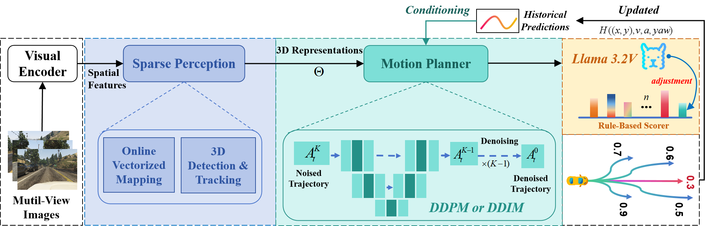
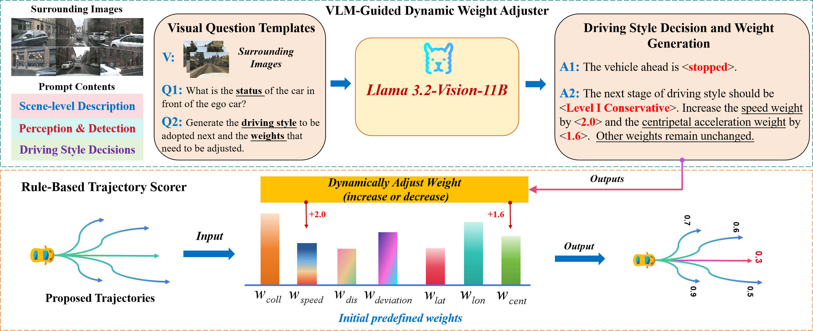

<div align="center">
    <h1>🤖 HE-Drive</h1>
    <h2> Human-Like End-to-End Driving with Vision Language Models</h2> <br>
</div>


## 📢 News


- [2024/10.08]: 🔥 We release the HE-Drive paper on arXiv !

</br>

## 📜 Introduction

**HE-Drive** is a groundbreaking end-to-end autonomous driving system that prioritizes human-like driving characteristics, ensuring both temporal consistency and comfort in generated trajectories. By leveraging sparse perception for key 3D spatial representations, a DDPM-based motion planner for generating multi-modal trajectories, and a VLM-guided trajectory scorer for selecting the most comfortable option, HE-Drive sets a new standard in autonomous driving performance and efficiency. This innovative approach not only significantly reduces collision rates and improves computational speed compared to existing solutions but also delivers the most comfortable driving experience based on real-world data.


<p align="center">
  
</p>

<br>

<p align="center">
  
</p>
<br>


## 🚀 Citing

```
@article{wang2024he,
  title={HE-Drive: Human-Like End-to-End Driving with Vision Language Models},
  author={Wang, Junming and Zhang, Xingyu and Xing, Zebin and Gu, Songen and Guo, Xiaoyang and Hu, Yang and Song, Ziying and Zhang, Qian and Long, Xiaoxiao and Yin, Wei},
  journal={arXiv preprint arXiv:2410.05051},
  year={2024}
} 
```

Please kindly star ⭐️ this project if it helps you. We take great efforts to develop and maintain it 😁.


## 🛠️ Installation

> [!NOTE]
> Installation steps follow [SparseDrive](https://github.com/swc-17/SparseDrive)

### Set up a new virtual environment
```bash
conda create -n hedrive python=3.8 -y
conda activate hedrive
```

### Install dependency packpages
```bash
hedrive_path="path/to/hedrive"
cd ${hedrive_path}
pip3 install --upgrade pip
pip3 install torch==1.13.0+cu116 torchvision==0.14.0+cu116 torchaudio==0.13.0 --extra-index-url https://download.pytorch.org/whl/cu116
pip3 install -r requirement.txt
```

### Compile the deformable_aggregation CUDA op
```bash
cd projects/mmdet3d_plugin/ops
python3 setup.py develop
cd ../../../
```

### Prepare the data
Download the [NuScenes dataset](https://www.nuscenes.org/nuscenes#download) and CAN bus expansion, put CAN bus expansion in /path/to/nuscenes, create symbolic links.
```bash
cd ${hedrive_path}
mkdir data
ln -s path/to/nuscenes ./data/nuscenes
```

Pack the meta-information and labels of the dataset, and generate the required pkl files to data/infos. Note that we also generate map_annos in data_converter, with a roi_size of (30, 60) as default, if you want a different range, you can modify roi_size in tools/data_converter/nuscenes_converter.py.
```bash
sh scripts/create_data.sh
```
### Prepare the 3D representation
> [!NOTE]
> Generate 3D representation using SparseDrive second stage checkpoint!


### Commence training
```bash
# train
sh scripts/train.sh
```

### Install Ollama and Llama 3.2-Vision 11B
> [!NOTE]
> Download Ollama 0.4, then run:

```bash
ollama run llama3.2-vision-11b
```

> [!IMPORTANT]
> Llama 3.2 Vision 11B requires least 8GB of VRAM.
> 
> Please prepare at least 10 sets of VQA templates to complete the dialogue, focusing the llama knowledge domain on driving style assessment.

### Commence testing

```bash
# test
sh scripts/test.sh
```

## 💽 Dataset

- [x] nuScenes
- [x] Real-World Data
- [x] OpenScene/NAVSIM


## 🏆 Acknowledgement
Many thanks to these excellent open source projects:
- [SparseDrive](https://github.com/swc-17/SparseDrive) 
- [DP](https://github.com/real-stanford/diffusion_policy)
- [DP3](https://github.com/YanjieZe/3D-Diffusion-Policy)
- [OpenScene](https://github.com/OpenDriveLab/OpenScene)
- [NAVSIM](https://github.com/autonomousvision/navsim)

